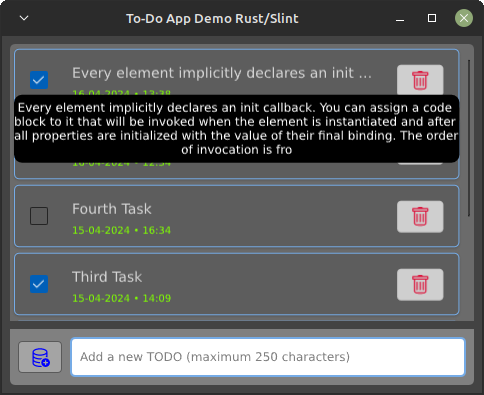

<div align="center">
  
<h1 align="center">rust-slint-todolist-demo</h1>


<hr />

<p style="margin-bottom: 16px;">
    Rust/Slint desktop demo application that uses the Slint GUI framework and persists data in a database-like binary file, performs a full CRUD, and displays a to-do list in GUI.
</p>

<br />
  
  

</div>

<hr />

>🤦 Yes, just another to-do application, but to try something new you have to start somewhere ¯\\\_(ツ)\_/¯.

## Usage

#### Run the application:

Install the Rust toolchain and run the following command in the root directory of the project:

```bash
cargo run
```

This app optionally accepts a TODO file location to load tasks from, making it easier to organize TODO tasks. The location of the `.todo.dat` file can be passed to both the cargo run command and the executable itself. e.g:

```bash
cargo run ~/.todo.dat # ./target/debug/rust-slint-todolist-demo ~/.todo.dat
```

>[!NOTE]
>***We recommend using an IDE for development, along with the [LSP-based IDE integration for .`slint` files](https://github.com/slint-ui/slint/blob/master/tools/lsp/README.md) provided by the library itself. You can also load this project directly into [Visual Studio Code](https://code.visualstudio.com) and install the [Slint extension](https://marketplace.visualstudio.com/items?itemName=Slint.slint).***

#### 🖼️ Screenshot

<div align="center">

###### Application window showing a popup (which opens when double-clicking) of an item whose text overflows its box:



</div>

#### Create an app bundle (`.deb` file & executable binary):

Run the following command at the root of the project (it is necessary to have installed [`cargo bundle`](https://crates.io/crates/cargo-bundle) in the system using `cargo install`):

```bash
cargo bundle --release
```

>[!NOTE]
>***On Linux, if you install the application using the `.deb` file, a `.todo.dat` file will be generated in the user folder when you press the add TODO button. The path of said file can be established if we edit the application preferences from its launcher.***

## Next Steps

Hope this demo helps you get started and that you enjoy exploring creating user interfaces with [`Slint`](https://slint.dev/). For more information about the [`Slint` Rust API](https://releases.slint.dev/1.5.1/docs/rust/slint/) and the [`.slint` markup language](https://releases.slint.dev/1.5.1/docs/slint/), see the online documentation.


## Happy coding 😀!!
